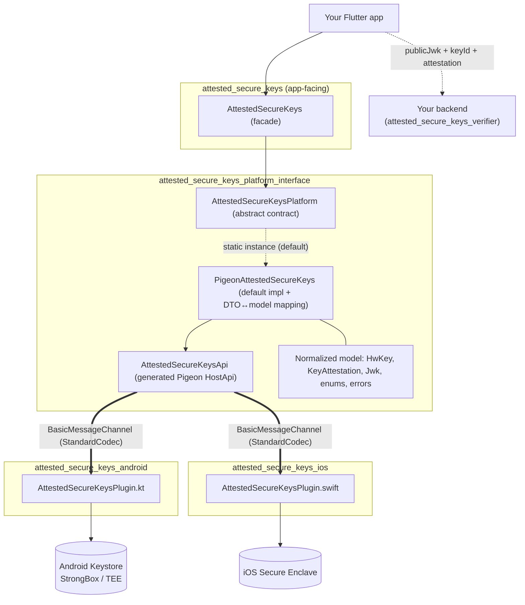
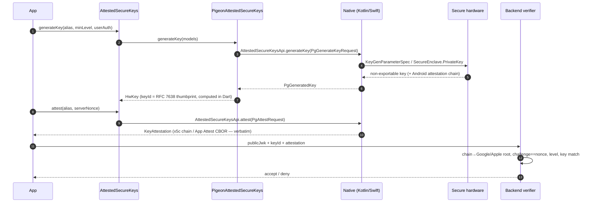
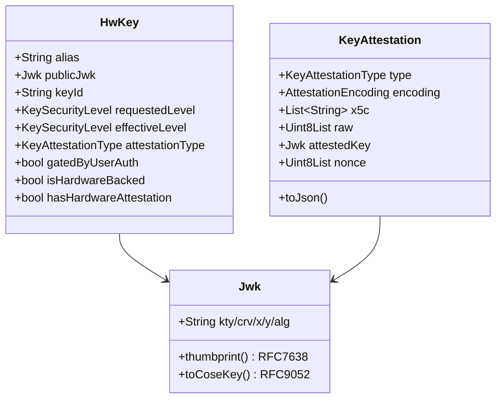

# attested_secure_keys — design

A short tour of how the library is put together: the layers, the typed platform
channel, and the runtime flows. Diagrams are Mermaid (they render on GitHub).

## 1. Layers & packages

The plugin is **federated** and resolved as a single **pub workspace**. App code
only ever touches the `AttestedSecureKeys` facade; everything below it is an
implementation detail.



**Why this shape.** The platform interface speaks the *clean public model*, not
the Pigeon DTOs — so `PigeonAttestedSecureKeys` is the single place that maps
`Pg*` wire types to/from `HwKey`/`KeyAttestation`/etc. and translates
`PlatformException`s into typed errors. A future platform (desktop/web) just
`extends AttestedSecureKeysPlatform`. The `…_android` / `…_ios` packages are
endorsed via `default_package`; their Dart registrants set the platform instance.

## 2. Public API (facade)

| Method | Returns | Purpose |
|---|---|---|
| `capabilities()` | `DeviceKeyCapabilities` | probe StrongBox/TEE/SE, attestation & biometric support |
| `generateKey(alias, minSecurityLevel, userAuth, aOptions, iOptions)` | `HwKey` | non-exportable EC P-256 key; throws `HwKeyUnsupportedError` if floor unmet |
| `sign(alias, payload, promptTitle, promptSubtitle)` | `Es256Signature` | ES256, raw `R‖S`; biometric prompt if gated |
| `attest(alias, serverNonce)` | `KeyAttestation` | verbatim attestation bound to the nonce |
| `getKeyInfo(alias)` / `containsKey` / `deleteKey` / `listAliases` | — | key lifecycle |

Full signatures + types: see the package README.

## 3. The platform channel (Pigeon)

There is **no raw `MethodChannel`** and no `Map<String,dynamic>` across the
boundary. A single Pigeon schema
([`pigeons/messages.dart`](../packages/attested_secure_keys_platform_interface/pigeons/messages.dart))
generates type-safe Dart, Kotlin, and Swift. Regenerate with:

```bash
cd packages/attested_secure_keys_platform_interface
dart run pigeon --input pigeons/messages.dart
```

The generated `@HostApi` is `AttestedSecureKeysApi` (Dart calls → native
implements). Each method is its own `BasicMessageChannel`:

```
dev.flutter.pigeon.attested_secure_keys.AttestedSecureKeysApi.<method>
```

…for `generateKey`, `sign`, `attest`, `getKeyInfo`, `containsKey`, `deleteKey`,
`listAliases`, `capabilities`.

**Wire DTOs** (prefixed `Pg`, never exposed publicly):
`PgGenerateKeyRequest`, `PgGeneratedKey`, `PgSignRequest`, `PgSignature`,
`PgAttestRequest`, `PgAttestation`, `PgKeyInfo`, `PgCapabilities`, `PgJwk`,
`PgUserAuthPolicy`, `PgAndroidKeyOptions`, `PgIosKeyOptions`, plus enums
(`PgSecurityLevel`, `PgAttestationType`, `PgUserAuthType`,
`PgAttestationEncoding`, `PgIosAccessibility`). Bytes cross as `Uint8List` ⇄
`ByteArray` ⇄ `FlutterStandardTypedData`.

Generated files (do not hand-edit): `lib/src/messages.g.dart`,
`android/.../Messages.g.kt`, `ios/Classes/Messages.g.swift`.

## 4. Runtime flows

### Generate → attest → server-verify



The **client never decides trust** — it ships the verbatim artifact and the
backend establishes trust against the real manufacturer roots.

### Sign with biometric gating (Android)

```mermaid
sequenceDiagram
  autonumber
  participant App
  participant N as Kotlin plugin
  participant BP as BiometricPrompt
  participant KS as Keystore

  App->>N: sign(alias, payload, promptTitle)
  N->>KS: Signature.initSign(privateKey)
  alt key is auth-gated
    N->>BP: authenticate(PromptInfo, CryptoObject(signature))
    BP-->>N: onAuthenticationSucceeded(cryptoObject)
    N->>KS: signature.update(payload); sign() → DER
  else not gated
    N->>KS: signature.update(payload); sign() → DER
  end
  N->>N: DER → raw R‖S (JDK BigInteger)
  N-->>App: Es256Signature (64-byte R‖S, base64url)
```

On iOS the equivalent is CryptoKit `SecureEnclave` signing whose
`ECDSASignature.rawRepresentation` is *already* raw `R‖S` (no DER step), with the
prompt driven by `SecAccessControl` + `LAContext`.

## 5. Data model (key types)



`KeySecurityLevel ∈ {strongBox, trustedEnvironment, secureEnclave, software,
unknown}`; `KeyAttestationType ∈ {androidKeyAttestation, appleAppAttest, none}`.

## 6. Threading, errors, trust boundary

- **Threading.** Pigeon `@async` host methods complete via a callback; native
  keystore work runs on the platform thread today (TODO: background executor).
  The Android biometric path completes from `BiometricPrompt`'s main-thread
  callback.
- **Errors.** Native throws `FlutterError`/`PigeonError` with a stable `code`
  (`unsupported_security_level`, `user_not_authenticated`, `key_not_found`,
  `attestation_unavailable`, `key_operation_failed`); `PigeonAttestedSecureKeys`
  maps these to typed `AttestedSecureKeysException`s.
- **Trust boundary.** Private keys never cross the channel — only handles, public
  JWKs, signatures, and attestation artifacts do. `securityLevel` is a UX hint;
  trust is established server-side (see [DEVICE_TESTING.md](DEVICE_TESTING.md)).
